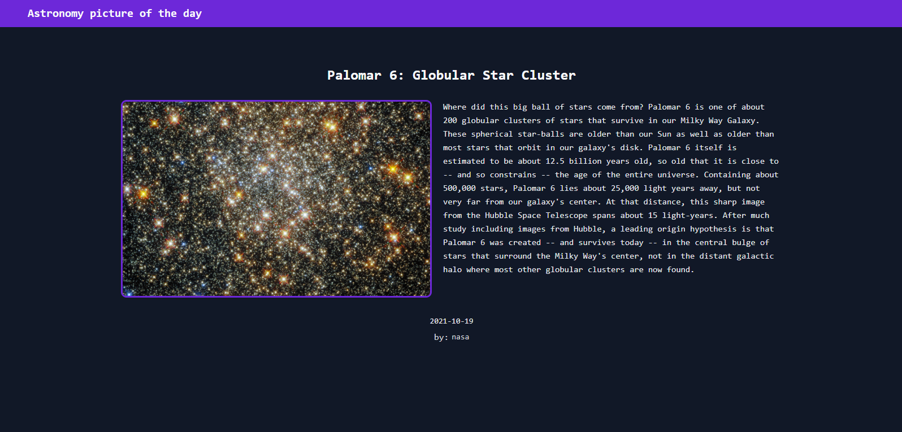

<h2 align="center">APOD</h2>
<h3 align="center">Astronomy Picture of the Day</h3>

 

    

 

_"Each day a different image or photograph of our fascinating universe is featured, along with a brief explanation written by a professional astronomer."_

This project use the NASA API to show an Astronomy Picture of the day. 👩‍🚀👨‍🚀

---
Made with 💖 by [Rodrigo Cabral](https://www.linkedin.com/in/rodcabral)
